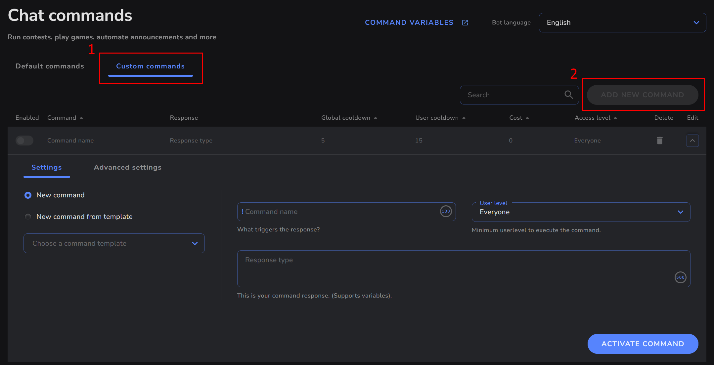
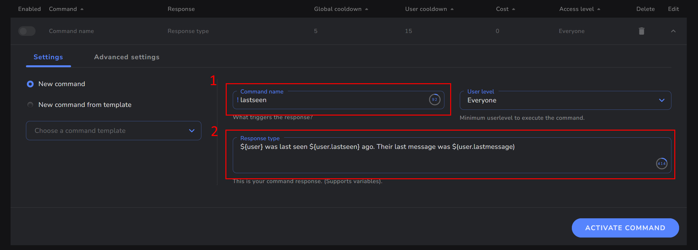
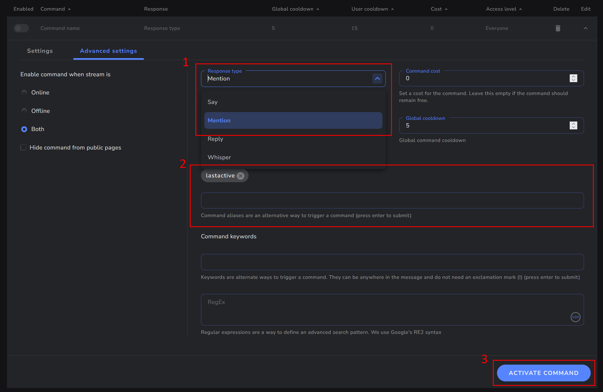

# Creating a command

## Overview

Commands are the main way users will interact with the bot in your chat. They can be used to trigger actions, or to display information to your users. In this example we will create a command that will display the amount of time that has past since a user was last seen in chat.

## Step 1 - Open the command creation tool

1. From the [bot command dashboard](https://streamelements.com/dashboard/bot/commands), navigate to the "Custom Commands" tab.
2. Click the "Add New Command" button to open the command creation tool.

## Step 2 - Basic settings

1. Enter the desired name for your new command. For this example we will name the command "lastseen".
2. Add your desired response. For a list of all available variables, see the [variables documentation](../../variables).

## Step 3 - Advanced settings

1. Optional: In the "Response Type" dropdown, select the method you would like the bot to use to send the response.
  - "Say" will send the response as a chat message as it is entered in the basic settings.
  - "Mention" will send the response as a chat message, but will prefix the message with [`@$(user),`](../../variables/sender).
  - "Reply" will send the response as a native reply to the user who triggered the command.
    - NOTE: If the platform does not support native replies, the response will be sent as a "Mention" instead.
  - "Whisper" will send the response as a whisper to the user who triggered the command.
2. Optional: Add one or more command aliases to allow users to trigger the same command using alternate names.
3. Click the "Activate Command" button to save your new command.

